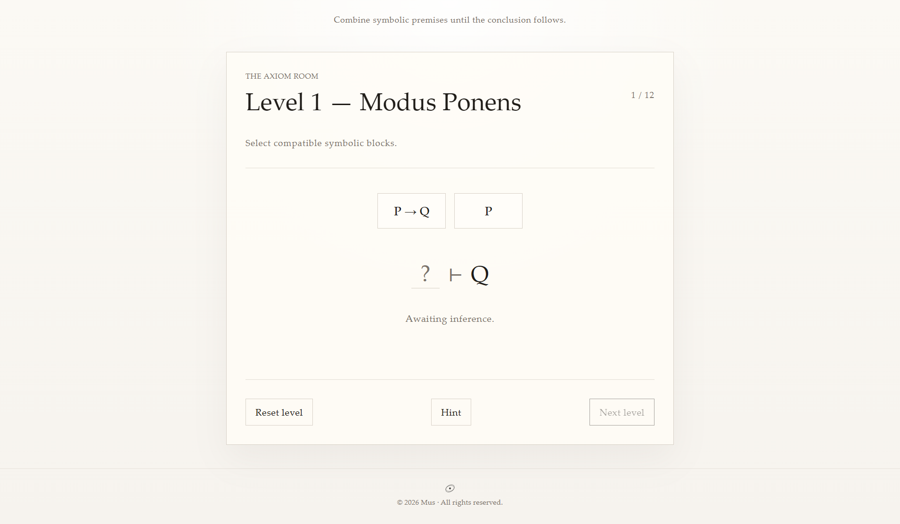

# The Axiom Room

**The Axiom Room** is a minimalist educational logic puzzle about symbolic inference, proof chains, and fundamental mathematical reasoning.

Players combine symbolic blocks such as `P → Q`, `P`, `¬Q`, and `P ∧ Q` to derive valid conclusions inside a quiet, academic interface.



## What It Is

This project explores how formal logic can be learned through interaction rather than long explanation.

The current prototype focuses on:

* propositional logic
* inference rules
* short proof chains
* decoy steps that may be valid but not useful
* minimal hints

## How to Play

Each level gives you a set of symbolic premises and a target conclusion.

Select compatible blocks to apply an inference rule.
When a valid inference is found, a new symbolic block may appear.
Reach the target conclusion to complete the level and receive:

```txt
■ Q.E.D.
```

Some levels include decoy blocks. A move can be mathematically valid and still be the wrong path for the current goal.

## Current Build

The current repository contains a small single-page prototype built with:

* `index.html`
* `style.css`
* `script.js`

The current logic wing includes 12 main levels and 2 optional challenge levels.

Covered patterns include:

* Modus Ponens
* Modus Tollens
* Hypothetical Syllogism
* Conjunction Introduction
* Simplification
* Disjunctive Syllogism
* Double Negation
* Contraposition
* chained proofs

## Run Locally

This project uses plain HTML, CSS, and JavaScript with no framework.

You can run it by either:

* opening `index.html` directly in a browser
* serving the folder with a small local server, then visiting the local URL

## Educational Scope

The Axiom Room is an experimental learning tool, not a full textbook or formal course in logic.

Its goal is to build intuition for symbolic reasoning through direct interaction. Some rules are simplified and represented only as needed for each level.

## Status

Prototype version.

This build focuses on the first logic puzzle wing. Future expansions may include set theory, proof structure, and quantifiers.

## Author

Created by **Mus**.

## License

Released under the [MIT License](./LICENSE).
